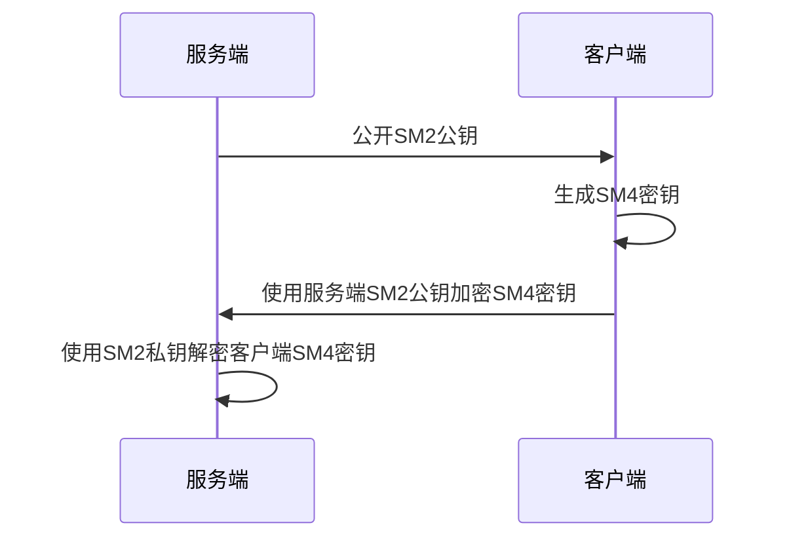
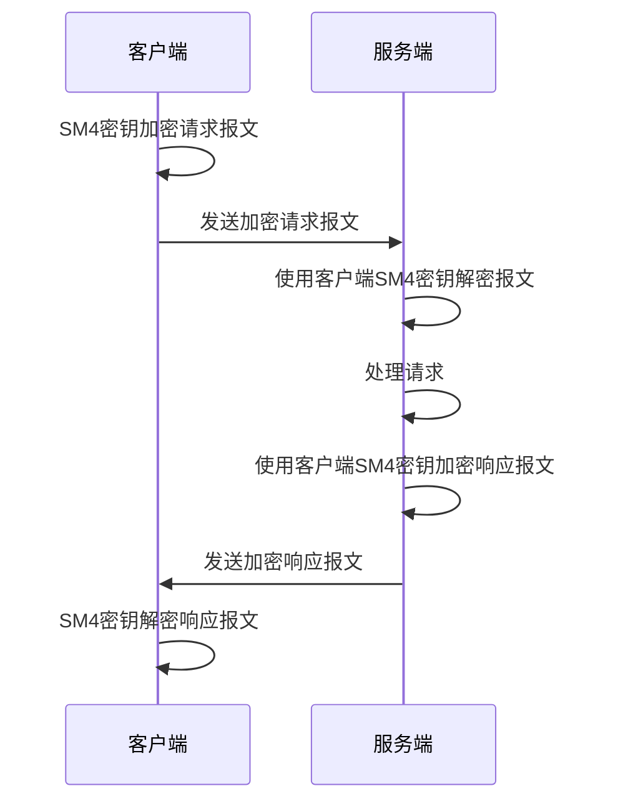

# Koala Cloud Gateway Starter

考拉网关启动模块

基于 [Spring Cloud Gateway](https://spring.io/projects/spring-cloud-gateway) 开发, 提供 动态路由 / 接口鉴权 / 接口日志 / 接口加密 等高级功能

## 快速开始

### 数据库

请先参照[快速开始](../../docs/guide/getting-started.md#初始化数据库)初始化数据库

### 网关配置

```yaml
koala:
  cloud:
    gateway:
      # 开启动态路由
      dynamic-routing: true
      # 关闭网关日志
      logging: false
```

## 进阶

### 动态路由

在数据库表 `k_route` 中进行路由配置, 对于 断言器 / 过滤器 / 元数据 等, 需转换为 `JSON` 格式:

```json
{
    "name": "StripPrefix",
    "args": {
        "parts": "1"
    }
}
```

### 接口鉴权

考拉网关有如下鉴权策略, 均为独立配置, 需要在路由中指定对应的过滤器:

| 鉴权策略 | 鉴权说明                                     | 鉴权过滤器              |
| -------- | -------------------------------------------- | ----------------------- |
| 权限校验 | 检查请求客户端是否拥有当前请求接口的授权信息 | `ApiAuthorization`      |
| IP校验   | 检查请求客户端IP是否授权信息中限制的IP       | `ApiAuthorizationIp`    |
| 配额校验 | 检查请求客户端是否超过授权信息中的配额限制   | `ApiAuthorizationQuota` |

### 接口日志

考拉网关会记录每次请求的日志, 共包含如下内容:

| 日志名称 | 日志内容                           | 日志数据表            |
| -------- | ---------------------------------- | --------------------- |
| 请求日志 | 记录所有请求相关信息及请求必要属性 | `k_api_request_log`   |
| 响应日志 | 记录所有响应相关信息               | `k_api_response_log`  |
| 异常日志 | 记录所有异常相关信息               | `k_api_exception_log` |

### 接口加密

网关会根据如下属性判断接口是否要进行加密:

1. 根据接口属性`is_support_encrypt`判断是否支持加密
2. 根据客户端设置`encrypted`判断是否已开启加密
3. 根据客户端设置`sm4-key`判断是否已提供密钥

密钥交换流程如下:



加密流程如下:



